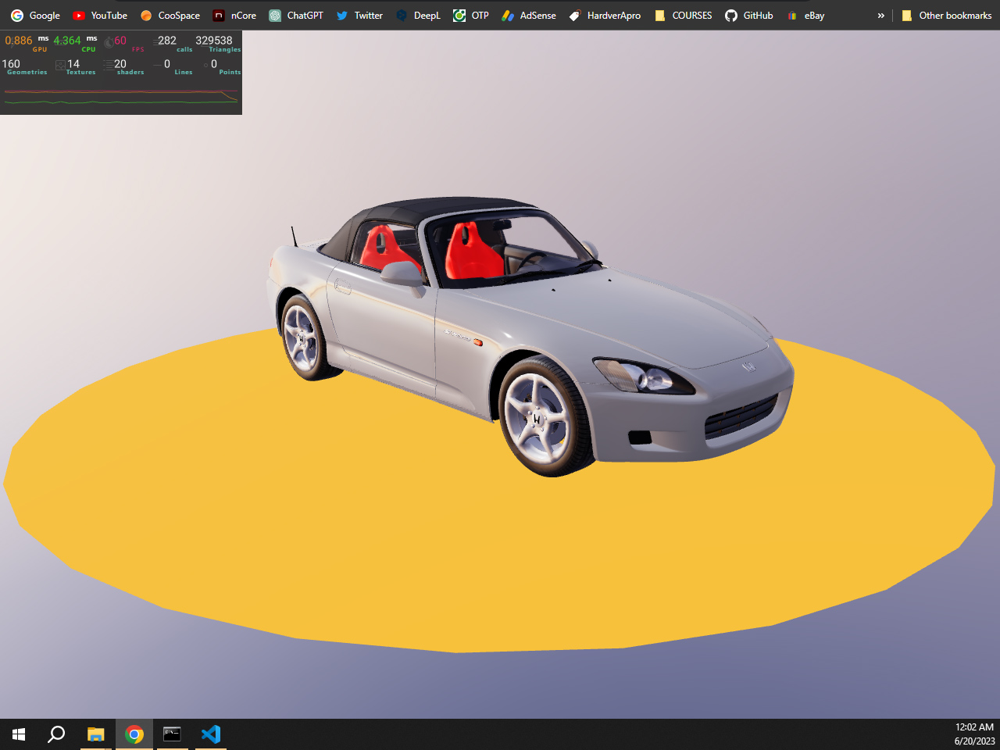

# WebGL 3D Car Showcase
Egy webalkalmazás 3D modellek realisztikus bemutatására

- [Szakdolgozat tartalomjegyzék (vázlat)](#szakdolgozat-tartalomjegyzék)
- [Progress Report - 2023.06.20](#progress-report---20230620)

### Setup

Download [Node.js](https://nodejs.org/en/download/).
Run the following commands:

``` bash
# Install dependencies
npm install

# Run the local server at localhost:8080
npm run dev
```

## Leírás

Az alkalmazást szakdolgozatomként készítem.
Egyre nagyobb az igény termékek, alkatrészek és egyéb grafiaki modellek vagy animációk 3D-ben való megjelenítésére a weben.
Sok VR, AR eszköz jelenik meg és ezek web böngészőt is futtatnak. Ezért gondoltam, hogy egy ilyen témában készítenem el a szakdolgozatomat, mivel az itt megszerzett tapasztalatot a jövőben is fel tudom majd használni.

## Projekt

A projekt célja egy webes felület létrehozása, ahol 3D modelleket (ezesetben autókat) tudunk megjeleníteni fotorealisztikus megvilágítással, jó minőségben.

A kamerával körbe tudunk forogni a 3D modell körül, rá tudunk közelíteni előre megadott keretek között.
Fontos szerepet fog kapni a töltés optimalizáltság is, mert a legtöbb dolgot a háttérben töltené be az alkalmazás.
(Pl. Ha van 3 autó modell, akkor az első töltése után már meg is jelenhetne, a többi meg töltődne tovább a háttérben)

Továbbá a felhasználó tudja majd állítani a fényezés és a féknyergek színét, felni típusát, üvegek sötítését stb.
Fotó módban az általa beállított kamera szögből fényképeket tud készíteni a konfigurált modellről.
Az alkalmazás lehetővé tenné, hogy a hátteret / környezet is tudja változtatni a user, ugye ezek szerint változnának a tükröződések és a fényviszonyok is.

## Megvalósítás

#### Web App

Az egyetemi "Számítógépes grafika" kurzuson megszerzett [Three.js](https://threejs.org) tapasztalokat vinném tovább, de egy keretrendszert használnék hozzá, ugyanis a React-nak van egy kifejezetten Three.js -re szánt verziója.

A [React Three Fiber](https://docs.pmnd.rs/react-three-fiber/getting-started/introduction)-ben lehetőség van komponensekre szétszedni az alkalmazásunkat és a 3D jelenetünket is.

Így lehetőség nyílik jól átlátható és újrafelhasználható komponensekből összerakni az alkalmazást.

Funkcionálisan kell majd megírni a kódot jsx vagy tsx kiterjesztésű forrásfájlokba.

---

#### 3D modellek
Az alkalmazásban felhasznált autókat a [Blender](https://www.blender.org) szoftverben készíteném elő a webes megjelenítésre.
Workflow:
  - Textúrák és VU-k létrehozása.
  - Árnyék és [ambient occlusion](https://en.wikipedia.org/wiki/Ambient_occlusion) textúrára égetése.
  - Azonos anyagú objektumok egyesítése, hogy minél kevesebb draw call -al dolgozzon az alkalmazás.
  - Objektumok hierarchiába rendezése és elnevezése, hogy később targetelni lehessen őket kódban, amikor új shadert kapnak beimportáláskor.
  
Modellek [glTF](https://www.khronos.org/gltf) fromátumban exportálom ki a 3D szoftverből, ugyanis a web app-ban [draco](https://google.github.io/draco) tömörítést fogok használni, hogy minél kevesebb idő menjen el a modellek betöltésére.

---
#### Shaderek
Az anyagok külön komponensekben lennének definiálva, hogy újrafelhasználhatók legyenek.
A legtöbb objektumon [PBR](https://en.wikipedia.org/wiki/Physically_based_rendering) material lenne használva (ugye a valósághű megjelenés miatt) és erre van a [MeshStandardMaterial](https://threejs.org/docs/#api/en/materials/MeshPhysicalMaterial) beépített shader a three.js -ben.

Speciális esetekben és erőforrás megtakarítás érdekében objektumtól / alkatrésztől függően más shaderek is fel lesznek használva.


---
#### Post Processing
Mivel minél valósághűbben jeleníteném meg a modelleket, szükség lesz utófeldolgozásra.
Pl. fényszórók fényéhez Bloom effektet használok, de LUT, FXAA és SSAO post-pro effektek is belekerülnek majd.
Ezeket érdemes lehet egy beállítások menübe ki-be kapcsolhatóvát tenni mivel, egy egy ilyen effeket több ms-t is igénybe vesz a renderingnél.
A react-three-fiber ben [EffectComposer](https://docs.pmnd.rs/react-postprocessing/effect-composer) komponens felhasználásával kezelhetőek ezek az effektek.

---

### Progress Report - 2023.06.20

Csak egy kis demo -val készültem a Szakdolgozat I. félévem végére, illetve a fentebb látható leírással.
Az első autó modell nagyjából kész állapotba került, ezt bele is raktam az alkalmazásba.



> Fontos megjegyezni, hogy még nem állítottam be a materialokat, egyik objektumra se, illetve nincsennek még összevonva különböző elemek.
(Ennek eredménye a sok draw call)
> Nincs beégetett árnyék és AO map.
Későbbi munkák után lesz rendes grafikai megjelenése modellnek.

---

## Szakdolgozat tartalomjegyzék

- Feladat leírása
- Bevezetés
- Tartalmi összefoglaló

1. #### 3D grafika a weben
   - WebGL előzmélnyei (Flash)
   - WebGL működése és előnyei
   - WebGPU (WebGL utódja)

2. #### Megvalósításhoz használt technológiák
   - Fejlesztői környezet (VSCode)
   - Vite
   - Three.js
   - React Three Fiber
   - Kód struktúra
   - Blender
  
3. #### Fejlesztési folyamat
   - Projekt létrehozás, előkészületek
   - Kamera beállítása és tulajdonságok
   - 3D modell betöltése
   - Geometriák
   - Materialok és textúrák
   - Materialok felhasználása a modellen
   - Környezet létrehozása, beállítsása
   - Fények, árnyékok
   - Post Processing Effektek
   - Irányítás (Egér és billentyűzet eventek)
   - Felhasználói felület (HTML  és WebGL)
   - Optimalizálás
   - Dinamikus betöltés

4. #### Elkészült projekt
   - Vercel hostolás
   - Elért eredmény és felhasználás
